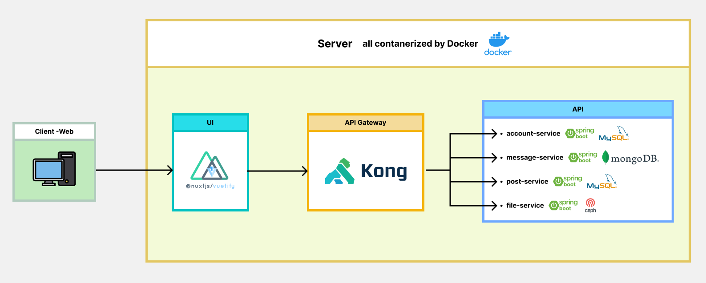

# microservices ( Social Media )

**Social Media** like friend and chatting

**NOTE: This project is not complete. It is only for practice.**

All information below is just my planning but did not get to finish it.

## Feature
1. Add/Remove/Block Friends
2. Chatting message in text or photo/file
3. Posting status > Like/Comment on status

## Structure

- **ui/frontend**
    - **framework** : nuxtjs + vuetify
    - **features**:
        - login/logout
        - register account
        - update profile
        - add/remove/block friend
        - add/update/remove post
        - like/comment on post
        - chat between friends

- **api gateway**
    - **Kong - api gateway**:
        - load balancing: separate workload between each service
        - rate limiting: limit requesting 
        - proxy caching: cache response entity of request to reduce latency

- **api/backend**
    - **account-service** ( crud account, friend, login/logout security )
        - **framework** : spring boot 2.6.7 - java17
        - **database**: MySQL8 ( using jpa & hibernate to create database and file and insert/delete record )
    - **message-service** ( send, receive, remove message )
        - **framework**: spring boot 2.6.7 - java17
        - **database**: MongoDB
        - message type text will store in MongoDB
        - info of account will request to account-service
        - message type file ( photo/video ) will request to file-service
    
    - **post-service** ( upload/remove post, like and comment )
        - **framework**: spring boot 2.6.7 - java17
        - **database**: MySQL8
    - **file-service**
        - **framework**: spring boot - java17
        - **file-storage-system**: ( CEPH )
        - all images and videos like profile picture or message photos between friends are store inside this service

### How to run with docker
- docker-compose in `microservices/` include both docker from ui and api
- `cd ./microservices`

#### Running test
- `docker-compose -f docker-compose.test.yml up -d --build`

#### Running development environment
- `docker-compose -f docker-compose.dev.yml --profile kong-setup up -d --build`
- `docker-compose -f docker-compose.dev.yml up -d --build`

- localhost:1337 for kong gui (with user interface to manage kong gateway)
- localhost:8001 for kong gateway admin (to add or update kong configuration)
- localhost:8888 for kong gateway proxy (to access all upstream that was config in kong)
- localhost:4444 for pgadmin ( user: admin@admin.com, password: root )
- localhost:3000 for ui

#### Running production environment
- `docker-compose -f docker-compose.prod.yml up -d --build`

#### How to build or up service individually using docker-compose:
- up and build ui: `docker-compose -f docker-compose.xxx.yml up -d --build ui`

- up and build account-service and mysql: `docker-compose -f docker-compose.xxx.yml up -d --build mysql account-service`
